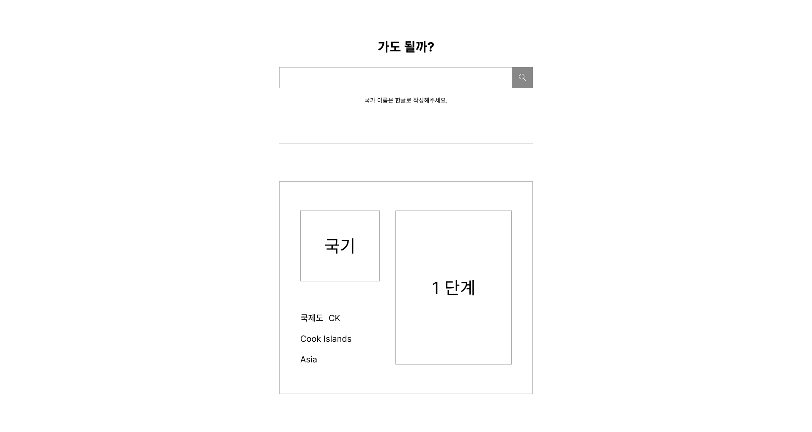

# 여행 경보 API

[공공데이터 포털의 국가∙지역별 여행경보](https://www.data.go.kr/tcs/dss/selectApiDataDetailView.do?publicDataPk=15076237) 데이터를 활용

 

# 구현된 모습

- 와이어프레임
    
    
    
 
 

# Skill & Tools

- HTML
- CSS
- VANILLA JAVASCRIPT
- Rest

 
 

# 기능

1. 검색창에 국가 이름을 검색했을 때 해당 국가 여행경보 출력
    - 국가 이름은 한글로 검색
    - 여행 경보 : 1~4단계, null은 특별여행경보

 
 

# 이 프로젝트를 하는 목적

- 공공데이터을 받아와 출력하는 방법을 학습
- **REST API 활용** 경험을 쌓기위해
- 실제 사용자가 사용할 수 있는 웹 어플리케이션을 제작해보기 위해

 
 

# 어려웠던 점 & 해결방법

 
 

# 리팩토링

 
 

# 회고

- 👻 **승원**

- 🤡 **보우**
- 🙉 **찬민**